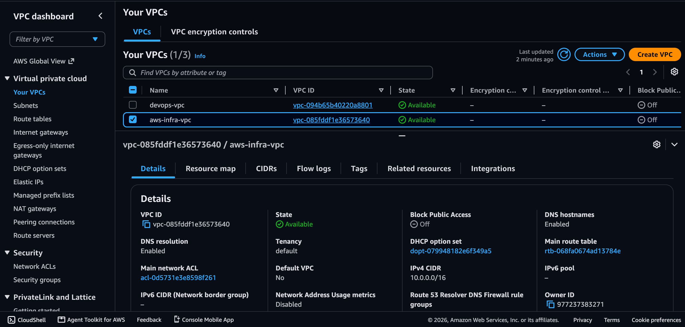
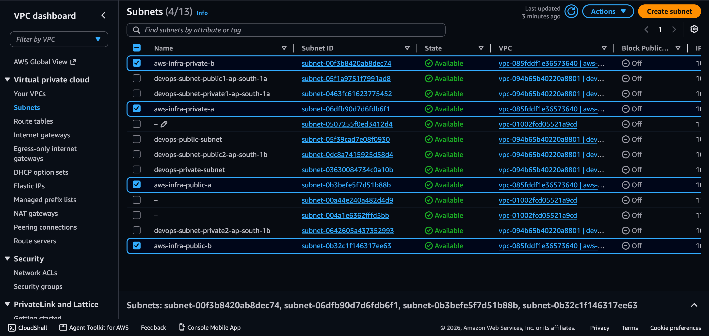
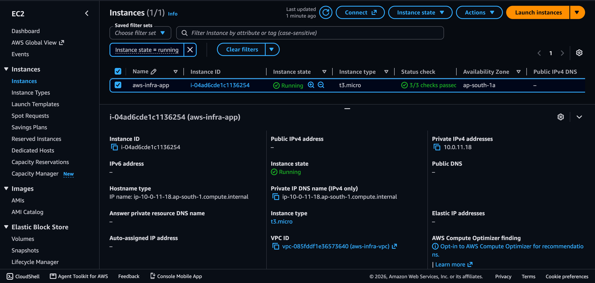
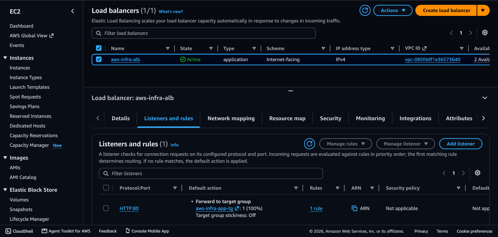
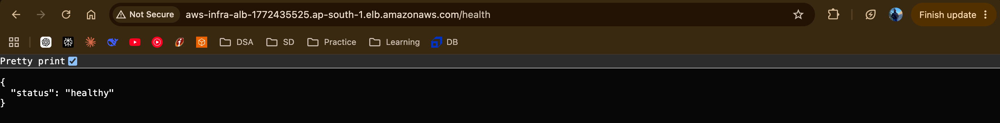
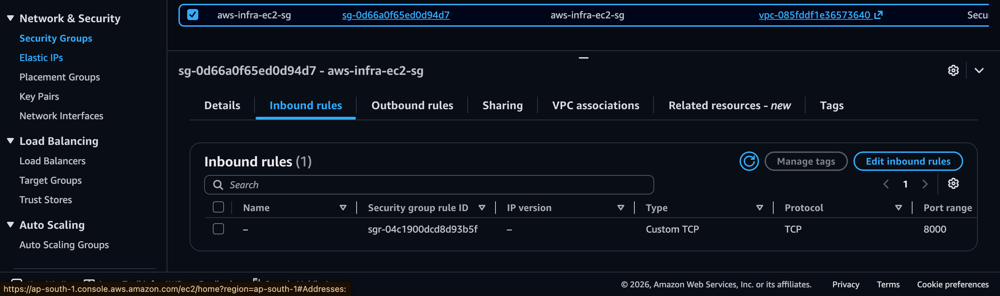
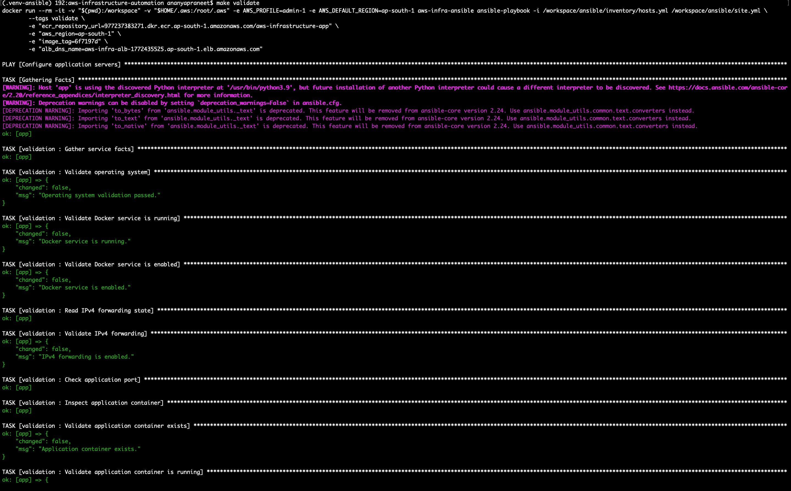
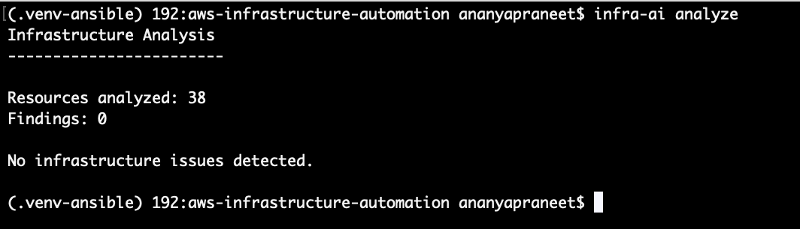
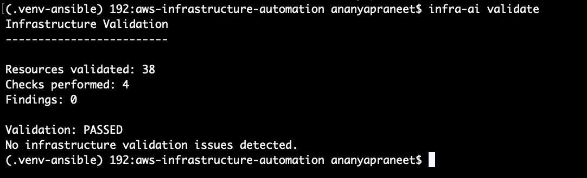

# AWS Infrastructure Automation Platform

[](LICENSE)

A production-oriented AWS infrastructure automation platform that provisions private cloud infrastructure, configures servers, deploys containerized applications, validates infrastructure, and provides **read-only AI-assisted infrastructure analysis and troubleshooting**.

Built with **Terraform, Ansible, Docker, Amazon ECR, AWS Systems Manager, Application Load Balancer, Make, Python, Flask, and OpenAI**.

---

## Overview

This project demonstrates an end-to-end infrastructure automation workflow covering:

* AWS infrastructure provisioning
* Private VPC networking
* Security group and IAM design
* Private EC2 compute
* Application Load Balancing
* AWS Systems Manager-based server management
* Ansible configuration management
* Docker application deployment
* Private Amazon ECR connectivity
* Immutable container image deployments
* Infrastructure and application validation
* Reproducible operator workflows
* Deterministic infrastructure analysis
* AI-assisted infrastructure explanations
* AI-assisted troubleshooting
* Infrastructure validation

The platform intentionally avoids public SSH access and does not use a NAT Gateway.

Private EC2 instances are managed through **AWS Systems Manager Session Manager**, while private container images are retrieved through **VPC endpoints**.

The project is designed around a simple lifecycle:

```text
Provision
    ↓
Configure
    ↓
Deploy
    ↓
Validate
    ↓
Analyze
```

Terraform remains the infrastructure source of truth, Ansible handles server configuration and deployment, and the AI layer operates in a **read-only** capacity.

---

# Highlights

### Infrastructure as Code

Terraform provisions the complete AWS environment including:

* VPC
* Public and private subnets
* Route tables
* Security groups
* EC2
* Application Load Balancer
* IAM
* ECR
* SSM endpoints
* ECR endpoints
* S3 gateway endpoint

### Private-by-Design Architecture

The application EC2 instance:

* Has no public IP
* Does not expose SSH
* Runs inside a private subnet
* Is reachable by the ALB only on port `8000`
* Is managed through AWS Systems Manager

### Reproducible Automation

A Makefile provides a simple operator interface:

```bash
make provision
make configure
make deploy
make validate
make plan
make destroy
```

### Immutable Deployments

Application images are tagged using the current Git commit SHA.

```text
Git Commit
    ↓
Short SHA
    ↓
Docker Image
    ↓
Immutable ECR Tag
    ↓
Private EC2
```

### Infrastructure Validation

The validation system checks infrastructure, server configuration, Docker state, deployed image state, and application health.

### AI Infrastructure Copilot

The project includes a read-only AI layer for:

* Infrastructure analysis
* Infrastructure explanations
* Configuration explanations
* Security recommendations
* Deployment troubleshooting
* Failure analysis

The deterministic analysis layer runs before AI generation so that the AI consumes structured infrastructure findings rather than raw Terraform state.

---

# Architecture

```text
                              Internet
                                  │
                                  ▼
                         ┌─────────────────┐
                         │  Application    │
                         │      Load       │
                         │    Balancer     │
                         │      :80        │
                         └────────┬────────┘
                                  │
                                  │ HTTP :8000
                                  ▼
                    ┌─────────────────────────┐
                    │      Private EC2        │
                    │     Amazon Linux 2023   │
                    │                         │
                    │        Docker           │
                    │           │             │
                    │           ▼             │
                    │    Flask Application    │
                    │        :8000            │
                    └──────────┬──────────────┘
                               │
              ┌────────────────┼────────────────┐
              │                │                │
              ▼                ▼                ▼
        ECR Endpoints    SSM Endpoints      S3 Endpoint
              │                │
              ▼                ▼
        Amazon ECR       AWS Systems Manager
                               ▲
                               │
                               │ AWS SSM
                               │
                    ┌──────────┴──────────┐
                    │ Dockerized Ansible  │
                    │      Controller     │
                    └──────────┬──────────┘
                               ▲
                               │
                         Makefile CLI
                               ▲
                               │
                         Developer
```

The architecture separates:

* **Public traffic** through the Application Load Balancer
* **Private application execution** on EC2
* **Private server management** through AWS Systems Manager
* **Private container image access** through VPC endpoints
* **Infrastructure provisioning** through Terraform
* **Configuration management** through Ansible
* **Application deployment** through Docker and ECR
* **Validation** through Ansible
* **Infrastructure analysis** through the AI tooling

---

# Infrastructure Architecture

The AWS environment is deployed in:

```text
Region: ap-south-1
VPC:    10.0.0.0/16
```

Network layout:

```text
VPC 10.0.0.0/16
│
├── Public Subnets
│   ├── 10.0.1.0/24
│   └── 10.0.2.0/24
│       │
│       └── Application Load Balancer
│
└── Private Subnets
    ├── 10.0.11.0/24
    │   │
    │   └── Private EC2
    │
    └── 10.0.12.0/24
```

There is intentionally **no NAT Gateway**.

Private AWS service connectivity is provided through VPC endpoints.

### AWS Resources

| Component          | Configuration             |
| ------------------ | ------------------------- |
| Region             | `ap-south-1`              |
| VPC                | `10.0.0.0/16`             |
| Public Subnet 1    | `10.0.1.0/24`             |
| Public Subnet 2    | `10.0.2.0/24`             |
| Private Subnet 1   | `10.0.11.0/24`            |
| Private Subnet 2   | `10.0.12.0/24`            |
| EC2                | Amazon Linux 2023         |
| EC2 Type           | `t3.micro`                |
| Application Port   | `8000`                    |
| Load Balancer      | Application Load Balancer |
| Load Balancer Port | `80`                      |
| Container Registry | Amazon ECR                |
| Server Management  | AWS Systems Manager       |
| NAT Gateway        | Not used                  |

### VPC Overview



### Network and Subnets



---

# Private EC2 and SSM Management

The EC2 instance is intentionally private.

It does not require:

* A public IPv4 address
* Internet-facing SSH
* A bastion host
* SSH key distribution

Instead, the management path is:

```text
Developer
    │
    ▼
Dockerized Ansible Controller
    │
    │ AWS SSM
    ▼
SSM VPC Endpoints
    │
    ▼
Private EC2
```

The EC2 IAM role includes:

```text
AmazonSSMManagedInstanceCore
```

This allows Systems Manager to manage the instance without exposing SSH.

### Private EC2 / SSM Evidence



---

# Application Load Balancer

The Application Load Balancer provides the public entry point to the application.

```text
Internet
   │
   ▼
ALB :80
   │
   │ HTTP :8000
   ▼
Private EC2
   │
   ▼
Docker Container
   │
   ▼
Flask :8000
```

The EC2 security group does not allow unrestricted application access.

Application traffic is permitted only from the ALB security group.

### Load Balancer



### Application Health

The application exposes:

```text
GET /
GET /health
```

The health endpoint returns:

```json
{
  "status": "healthy"
}
```

The ALB health endpoint was successfully validated externally.



---

# Security Group Design

Security groups are separated by responsibility.

```text
Internet
   │
   ▼
ALB Security Group
   │
   │ TCP 8000
   ▼
EC2 Security Group
```

The EC2 security group:

* Allows application traffic from the ALB security group
* Does not expose SSH to the internet
* Does not allow unrestricted application access

The ALB is the public-facing component; the application server remains private.



---

# Private Container Image Connectivity

The EC2 instance does not require public internet access to retrieve its application image.

Private connectivity is provided through:

* ECR API interface endpoint
* ECR Docker Registry interface endpoint
* S3 gateway endpoint

The connectivity model is:

```text
Private EC2
     │
     ├── ECR API Endpoint
     │
     ├── ECR DKR Endpoint
     │
     └── S3 Gateway Endpoint
             │
             ▼
          Amazon ECR
```

This allows the application server to pull images from ECR without requiring a NAT Gateway.

---

# Docker Application

The application is a lightweight Flask service.

```text
Flask
  │
  ▼
Docker
  │
  ▼
Port 8000
```

Endpoints:

```text
GET /
GET /health
```

Example root response:

```json
{
  "service": "aws-infrastructure-automation",
  "status": "running"
}
```

Example health response:

```json
{
  "status": "healthy"
}
```

The application container:

* Uses Python 3.12
* Runs as a non-root user
* Exposes port `8000`
* Includes a Docker health check
* Is deployed through Ansible

---

# Git-Based Deployment

Application images are tagged using the current Git commit SHA.

The Makefile derives the tag with:

```makefile
IMAGE_TAG ?= $(shell git rev-parse --short HEAD)
```

For example:

```text
6f7197d
```

The resulting image becomes:

```text
aws-infrastructure-app:6f7197d
```

The image is pushed to Amazon ECR using the same immutable tag.

The deployment chain is therefore:

```text
Git Commit
    ↓
Short Commit SHA
    ↓
Docker Build
    ↓
Amazon ECR
    ↓
Private EC2
    ↓
Running Container
```

ECR uses **immutable image tags**, preventing an existing image tag from being overwritten.

This provides deployment traceability from source code to the running application.

---

# Deployment Flow

The complete deployment workflow is:

```text
Git Commit SHA
      │
      ▼
Docker Build
      │
      ▼
ECR Authentication
      │
      ▼
Immutable ECR Tag
      │
      ▼
Push Image
      │
      ▼
Ansible via SSM
      │
      ▼
Private EC2
      │
      ▼
Docker Pull
      │
      ▼
Container Replacement
      │
      ▼
Running Application
```

Terraform manages infrastructure.

Docker and ECR manage application images.

Ansible manages application deployment.

AWS Systems Manager provides the private management path.

---

# Reproducible Automation

The Makefile provides a simplified operator interface over the infrastructure lifecycle.

```bash
make provision
make configure
make deploy
make validate
make plan
make destroy
```

## Command Responsibilities

| Command          | Responsibility                                |
| ---------------- | --------------------------------------------- |
| `make provision` | Provision AWS infrastructure with Terraform   |
| `make plan`      | Preview Terraform infrastructure changes      |
| `make configure` | Configure private EC2 with Ansible            |
| `make deploy`    | Build, tag, push, and deploy the application  |
| `make validate`  | Validate infrastructure and application state |
| `make destroy`   | Destroy provisioned AWS infrastructure        |

The lifecycle remains intentionally separated:

```text
Provision
    ↓
Configure
    ↓
Deploy
    ↓
Validate
```

This makes each stage independently executable and easier to troubleshoot.

---

# Ansible Configuration

The Ansible playbook separates configuration, deployment, and validation through tags.

```yaml
---
- name: Configure application servers
  hosts: app_servers
  become: true

  roles:
    - { role: user_setup, tags: [configure] }
    - { role: ssh_hardening, tags: [configure] }
    - { role: system_config, tags: [configure] }
    - { role: docker, tags: [configure] }
    - { role: security_hardening, tags: [configure] }
    - { role: application, tags: [deploy] }
    - { role: validation, tags: [validate] }
```

The lifecycle can therefore be executed independently:

```bash
ansible-playbook \
  -i inventory/hosts.yml \
  site.yml \
  --tags configure
```

```bash
ansible-playbook \
  -i inventory/hosts.yml \
  site.yml \
  --tags deploy
```

```bash
ansible-playbook \
  -i inventory/hosts.yml \
  site.yml \
  --tags validate
```

The Makefile provides the corresponding simplified commands:

```bash
make configure
make deploy
make validate
```

---

# Dockerized Ansible Controller

The Ansible execution environment is itself containerized.

```text
Developer Machine
       │
       ▼
Docker
       │
       ▼
Ansible Controller
       │
       ├── Ansible Core
       ├── AWS CLI
       ├── Boto3
       ├── Session Manager Plugin
       └── Required Ansible Collections
       │
       ▼
AWS Systems Manager
```

The controller image is:

```text
aws-infra-ansible
```

Containerizing the controller provides:

* Reproducible Ansible execution
* Host Python isolation
* Consistent dependencies
* Linux-based execution behavior
* Portable automation
* Reliable Ansible-over-SSM execution

---

# Infrastructure Validation

The validation layer verifies both infrastructure and application state.

Checks include:

* Operating system
* Docker service state
* Docker service enabled state
* IPv4 forwarding
* Application port availability
* Application container existence
* Application container running state
* Container restart policy
* Expected ECR image tag
* Docker health status
* Local `/health` endpoint
* Deployed image existence
* Running container image
* Running container image matching the deployed image
* Application Load Balancer `/health` endpoint

The final validation run completed successfully:

```text
PLAY RECAP

app : ok=22 changed=0 unreachable=0 failed=0 skipped=0 rescued=0 ignored=0
```

### Deployment Validation Evidence



---

# AI Infrastructure Copilot

The project includes a read-only **AI Infrastructure Copilot**.

The AI layer does not provision infrastructure, execute commands, or directly modify AWS resources.

Its purpose is to help an operator understand infrastructure and diagnose issues while keeping infrastructure changes under explicit human control.

The architecture is:

```text
                    infra-ai
                       │
                       ▼
                Terraform JSON
                       │
                       ▼
          Deterministic Infrastructure
                 Analyzer
                       │
                       ▼
                    Findings
                       │
                       ▼
              AI Explanation Layer
                       │
                       ▼
        Human-readable Recommendations
```

The important design principle is:

```text
Terraform State
      ↓
Deterministic Analysis
      ↓
Structured Findings
      ↓
AI Interpretation
      ↓
Human Decision
```

The AI does not become the source of truth.

Terraform remains the source of truth for infrastructure.

---

# AI CLI

The project provides the following commands:

```bash
infra-ai analyze
infra-ai explain <file>
infra-ai troubleshoot <file>
infra-ai validate
```

---

## `infra-ai analyze`

Analyzes Terraform infrastructure using deterministic analysis.

The analyzer loads Terraform state through:

```text
terraform show -json
```

and extracts infrastructure resources for analysis.

The current infrastructure contains:

```text
38 resources
```

The analyzer checks areas including:

### Security

* Public SSH access
* Public application access

### IAM

* Systems Manager permissions
* ECR read permissions

### Network

* ECR API endpoint
* ECR Docker Registry endpoint
* SSM endpoint
* SSMMessages endpoint
* S3 endpoint

The current production infrastructure produces:

```text
Resources analyzed: 38
Findings: 0
```

### Infrastructure Analysis Evidence



---

# Deterministic Analysis

The AI layer is intentionally placed **after deterministic infrastructure analysis**.

For example, a controlled insecure security group test produces:

```text
Severity: HIGH
Category: SECURITY
Resource: test.security_group.insecure

Title:
SSH exposed to the internet

Recommendation:
Restrict SSH access to a trusted CIDR or use AWS Systems Manager.
```

This approach provides several advantages:

* Predictable infrastructure checks
* Testable findings
* Reduced hallucination risk
* Structured AI input
* Separation between detection and explanation

The AI receives structured findings rather than having to infer the infrastructure state from raw Terraform data.

---

# AI Explain

The `infra-ai explain` command accepts a file as its source of truth.

```bash
infra-ai explain <file>
```

The explanation layer is designed to:

* Explain observed infrastructure or configuration
* Use only the supplied file contents as evidence
* Distinguish observed configuration from recommendations
* Avoid inventing infrastructure
* Avoid executing commands
* Avoid automatically changing infrastructure

This makes the explanation layer suitable for reviewing configuration files, infrastructure artifacts, and operational outputs.

---

# AI Troubleshooting

The `infra-ai troubleshoot` command analyzes an operational failure or diagnostic file.

```bash
infra-ai troubleshoot <file>
```

The troubleshooting workflow is designed to identify:

1. Most likely cause
2. Evidence supporting the diagnosis
3. Other plausible causes when evidence is insufficient
4. Practical validation checks
5. Recommended resolution

The troubleshooting system explicitly distinguishes:

```text
Evidence
   ↓
Inference
   ↓
Recommendation
```

It does not assume access to systems or infrastructure that are not represented in the supplied input.

It also does not execute commands or automatically modify infrastructure.

A synthetic deployment failure fixture is included in the repository for testing the troubleshooting logic.

---

# Infrastructure Validation CLI

The `infra-ai validate` command provides deterministic infrastructure validation.

```bash
infra-ai validate
```

Current validation result:

```text
Infrastructure Validation
-------------------------

Resources validated: 38
Checks performed: 4
Findings: 0

Validation: PASSED
No infrastructure validation issues detected.
```

This provides a second validation interface alongside the Ansible deployment validation.

---

# Validation Evidence

The project includes multiple layers of validation.

### Ansible Validation

```text
app : ok=22 changed=0 unreachable=0 failed=0
```

### Infrastructure Validation

```text
Resources validated: 38
Checks performed: 4
Findings: 0

Validation: PASSED
```

### Automated Tests

```text
22 passed
```

### External Application Validation

The Application Load Balancer successfully returned:

```json
{
  "status": "healthy"
}
```

### Validation and Test Evidence



---

# Test Coverage

The AI and infrastructure automation components include automated tests covering:

```text
tests/
├── ai/
│   ├── test_openai.py
│   ├── test_prompts.py
│   └── test_reporting.py
│
├── cli/
│   ├── test_explain.py
│   └── test_troubleshoot.py
│
├── explain/
│   └── test_explainer.py
│
├── inputs/
│   └── test_files.py
│
├── troubleshoot/
│   └── test_troubleshooter.py
│
├── validation/
│   └── test_validator.py
│
└── fixtures/
    └── deployment-error.txt
```

The final test suite completed with:

```text
22 passed
```

---

# Repository Structure

```text
aws-infrastructure-automation/
│
├── app/
│   ├── app.py
│   ├── Dockerfile
│   └── requirements.txt
│
├── ansible/
│   ├── Dockerfile
│   ├── ansible.cfg
│   ├── inventory/
│   │   └── hosts.yml
│   ├── site.yml
│   └── roles/
│       ├── user_setup/
│       ├── ssh_hardening/
│       ├── system_config/
│       ├── docker/
│       ├── security_hardening/
│       ├── application/
│       └── validation/
│
├── infra_ai/
│   ├── ai/
│   │   ├── base.py
│   │   ├── openai.py
│   │   └── prompts.py
│   │
│   ├── analyzer/
│   │   ├── analyzer.py
│   │   ├── iam.py
│   │   ├── network.py
│   │   ├── security.py
│   │   ├── terraform.py
│   │   └── test_data.py
│   │
│   ├── cli/
│   │   └── main.py
│   │
│   ├── explain/
│   │   └── explainer.py
│   │
│   ├── inputs/
│   │   └── files.py
│   │
│   ├── reporting/
│   │   └── report.py
│   │
│   ├── troubleshoot/
│   │   └── troubleshooter.py
│   │
│   └── validation/
│       └── validator.py
│
├── terraform/
│   ├── alb.tf
│   ├── ansible_ssm.tf
│   ├── ec2.tf
│   ├── ecr.tf
│   ├── ecr_endpoints.tf
│   ├── iam.tf
│   ├── main.tf
│   ├── outputs.tf
│   ├── providers.tf
│   ├── routes.tf
│   ├── s3_endpoint.tf
│   ├── security_groups.tf
│   ├── ssm.tf
│   ├── subnets.tf
│   ├── variables.tf
│   ├── versions.tf
│   └── vpc.tf
│
├── tests/
│   ├── ai/
│   ├── cli/
│   ├── explain/
│   ├── fixtures/
│   ├── inputs/
│   ├── troubleshoot/
│   └── validation/
│
├── docs/
│   └── screenshots/
│       ├── 01-aws-vpc-overview.png
│       ├── 02-network-subnets.png
│       ├── 03-private-ec2-ssm.png
│       ├── 04-alb.png
│       ├── 05-security-groups.png
│       ├── 06-alb-health.png
│       ├── 07-deployment-validation.png
│       ├── 08-ai-infrastructure-analysis.png
│       └── 09-validation-and-tests.png
│
├── Makefile
├── .gitignore
└── README.md
```

---

# Technology Stack

## Infrastructure

* AWS
* Terraform
* VPC
* EC2
* Application Load Balancer
* IAM
* Amazon ECR
* AWS Systems Manager
* VPC Endpoints

## Configuration Management

* Ansible
* AWS SSM connection plugin
* Dockerized Ansible controller
* Ansible Collections

## Application

* Python
* Flask
* Docker

## Automation

* Make
* Git
* Bash

## AI

* Python
* OpenAI API
* Deterministic infrastructure analysis
* AI-assisted explanations
* AI-assisted troubleshooting
* Infrastructure validation

---

# Security Considerations

Security was considered throughout the infrastructure design rather than added as a final layer.

## No Public EC2 Access

The EC2 instance does not expose SSH to the internet.

## Private Server Management

AWS Systems Manager is used instead of public SSH.

## Private Application Server

The application runs on a private EC2 instance.

## Security Group Separation

The ALB and EC2 use separate security groups.

The EC2 security group accepts application traffic only from the ALB security group.

## Non-Root Container

The application container runs as a non-root user.

## Immutable ECR Tags

ECR image tags are configured as immutable.

## ECR Image Scanning

ECR scan-on-push is enabled.

## IAM Permissions

The EC2 instance is assigned permissions required for:

* Systems Manager management
* ECR image retrieval

## Read-Only AI

The AI layer cannot directly modify AWS infrastructure.

Its responsibility is limited to:

```text
Analyze
Explain
Recommend
Troubleshoot
Validate
```

Infrastructure changes remain an explicit operator responsibility.

---

# Cost Considerations

The architecture is designed to avoid unnecessary infrastructure costs while maintaining a realistic production-oriented topology.

The design intentionally avoids:

* NAT Gateway
* Bastion host
* Public EC2 management
* Unnecessary managed services

Private AWS service connectivity is instead provided using VPC endpoints.

The main cost-bearing components in this architecture can include:

* EC2
* Application Load Balancer
* VPC interface endpoints
* ECR storage and image transfer
* S3 usage
* AWS Systems Manager-related services depending on usage

The absence of a NAT Gateway is particularly intentional because NAT Gateway hourly and data-processing charges can be significant for a small portfolio environment.

The architecture therefore demonstrates a practical trade-off between **private connectivity, security, and cost awareness** rather than assuming that private networking is automatically free.

---

# Host Prerequisites

The operator machine requires:

* Docker
* AWS CLI
* Terraform
* Make
* Git

AWS credentials must also be configured.

The current Makefile defaults to:

```text
AWS_PROFILE=admin-1
AWS_REGION=ap-south-1
```

The Dockerized Ansible controller image must be available locally:

```text
aws-infra-ansible
```

Docker and AWS CLI remain host prerequisites because they are used for operations such as:

* Building the application image
* Authenticating to ECR
* Pushing the application image
* Running the Ansible controller

---

# Deployment

## 1. Configure AWS

Configure an AWS CLI profile with permissions to provision the required infrastructure.

The project currently uses:

```text
AWS_PROFILE=admin-1
AWS_REGION=ap-south-1
```

These values can be overridden:

```bash
AWS_PROFILE=<profile> AWS_REGION=<region> make provision
```

---

## 2. Provision Infrastructure

Initialize and apply Terraform:

```bash
make provision
```

Or preview changes first:

```bash
make plan
```

Terraform provisions the AWS networking, security, compute, load balancing, IAM, ECR, SSM, and private connectivity components.

---

## 3. Configure the Server

Run the Ansible configuration workflow:

```bash
make configure
```

This configures the private EC2 instance through AWS Systems Manager.

---

## 4. Deploy the Application

Build and deploy the application:

```bash
make deploy
```

The workflow performs:

```text
Docker Build
    ↓
ECR Login
    ↓
Git SHA Tag
    ↓
ECR Push
    ↓
Ansible Deployment
    ↓
AWS SSM
    ↓
Private EC2
```

---

## 5. Validate

Run:

```bash
make validate
```

The validation workflow checks the server, Docker, deployed image, container health, application endpoint, and ALB health.

---

## 6. Analyze Infrastructure

Run the infrastructure analyzer:

```bash
infra-ai analyze
```

Expected healthy infrastructure result:

```text
Resources analyzed: 38
Findings: 0
```

---

## 7. Validate Infrastructure with the AI CLI

Run:

```bash
infra-ai validate
```

Expected result:

```text
Resources validated: 38
Checks performed: 4
Findings: 0

Validation: PASSED
```

---

# Cleanup

When the environment is no longer required, destroy the provisioned AWS resources:

```bash
make destroy
```

This executes:

```text
terraform destroy
```

Before destroying an environment, ensure that any resources or data that need to be retained have been backed up.

---

# Failure Scenarios and Troubleshooting

The project includes a synthetic deployment failure fixture:

```text
tests/fixtures/deployment-error.txt
```

The fixture represents an application deployment failure involving an ECR authentication problem.

The troubleshooting CLI can analyze the fixture with:

```bash
infra-ai troubleshoot tests/fixtures/deployment-error.txt
```

The purpose of the fixture is to test the troubleshooting workflow without requiring a live infrastructure failure.

The troubleshooting design emphasizes:

```text
Observed Evidence
        ↓
Likely Cause
        ↓
Additional Possibilities
        ↓
Validation Checks
        ↓
Recommended Resolution
```

The system does not automatically modify infrastructure based on its diagnosis.

---

# Screenshots

The repository includes visual evidence of the deployed infrastructure and validation workflow.

### AWS VPC


### Network and Subnets


### Private EC2 and SSM


### Application Load Balancer


### Security Groups


### ALB Health Endpoint


### Deployment Validation


### AI Infrastructure Analysis


### Validation and Automated Tests


---

# Key Design Decisions

## Why private EC2?

The application server does not need to be directly accessible from the internet.

The ALB provides the public application entry point while EC2 remains private.

## Why AWS Systems Manager instead of SSH?

SSM removes the need for:

* Public IP addresses
* Public SSH
* Bastion infrastructure
* SSH key distribution

This significantly reduces the attack surface of the management plane.

## Why no NAT Gateway?

The application server only needs private access to selected AWS services.

VPC endpoints provide this connectivity while avoiding the recurring cost of a NAT Gateway.

## Why immutable ECR tags?

Git commit SHA-based immutable tags create a direct relationship between:

```text
Source Code
    ↓
Git Commit
    ↓
Docker Image
    ↓
ECR
    ↓
Deployment
```

This improves deployment traceability and prevents accidental tag reuse.

## Why deterministic analysis before AI?

AI is useful for explanation and reasoning, but infrastructure policy checks should be deterministic wherever possible.

Therefore:

```text
Infrastructure
      ↓
Deterministic Checks
      ↓
Structured Findings
      ↓
AI Explanation
```

This reduces ambiguity and makes the core security checks testable.

## Why read-only AI?

An AI system should not directly mutate production infrastructure based on generated output.

The project therefore deliberately separates:

```text
AI Recommendation
        ≠
Infrastructure Change
```

The human operator remains responsible for reviewing and applying changes.

---

# Development Stages

The project was developed incrementally to demonstrate the evolution from basic infrastructure provisioning to a complete automation and analysis platform.

```text
Stage 1
Project Initialization
        ↓
Stage 2
Terraform Foundation
        ↓
Stage 3
AWS Networking
        ↓
Stage 4
Security & IAM
        ↓
Stage 5
EC2 + ALB + Private SSM + Private Connectivity
        ↓
Stage 6
Ansible Configuration
        ↓
Stage 7
Docker Application Deployment
        ↓
Stage 8
Monitoring & Validation
        ↓
Stage 9
Reproducible Automation
        ↓
Stage 10
AI Infrastructure Copilot
        ↓
Stage 11
AI Explain & Failure Analysis
        ↓
Stage 12
Portfolio & Documentation
```

---

# Project Status

| Area                           | Status     |
| ------------------------------ | ---------- |
| Terraform Infrastructure       | ✅ Complete |
| VPC Networking                 | ✅ Complete |
| Security Groups                | ✅ Complete |
| IAM                            | ✅ Complete |
| Private EC2                    | ✅ Complete |
| Application Load Balancer      | ✅ Complete |
| AWS Systems Manager            | ✅ Complete |
| Private ECR Connectivity       | ✅ Complete |
| Ansible Configuration          | ✅ Complete |
| Docker Application Deployment  | ✅ Complete |
| Infrastructure Validation      | ✅ Complete |
| Reproducible Makefile Workflow | ✅ Complete |
| AI Infrastructure Analysis     | ✅ Complete |
| AI Infrastructure Explanation  | ✅ Complete |
| AI Troubleshooting             | ✅ Complete |
| AI Infrastructure Validation   | ✅ Complete |
| Portfolio Documentation        | ✅ Complete |

---

# Final Validation

The completed platform has been validated across the major layers:

```text
Terraform
   │
   ▼
AWS Infrastructure
   │
   ▼
Ansible Configuration
   │
   ▼
Docker Deployment
   │
   ▼
Private EC2
   │
   ▼
Application Load Balancer
   │
   ▼
/health → 200 OK
```

And the infrastructure analysis path:

```text
Terraform State
      │
      ▼
Deterministic Analyzer
      │
      ▼
38 Resources
      │
      ▼
0 Findings
      │
      ▼
Validation Passed
```

Automated tests completed successfully:

```text
22 passed
```

Ansible validation completed successfully:

```text
app : ok=22 changed=0 unreachable=0 failed=0
```

The platform therefore demonstrates a complete infrastructure lifecycle from **provisioning to deployment, validation, and AI-assisted analysis**.

---

# License

This project is licensed under the MIT License.

See [LICENSE](LICENSE) for details.

